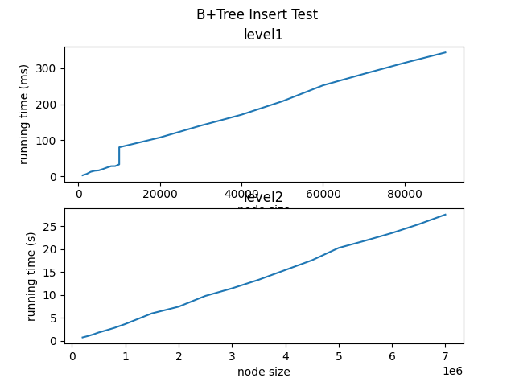
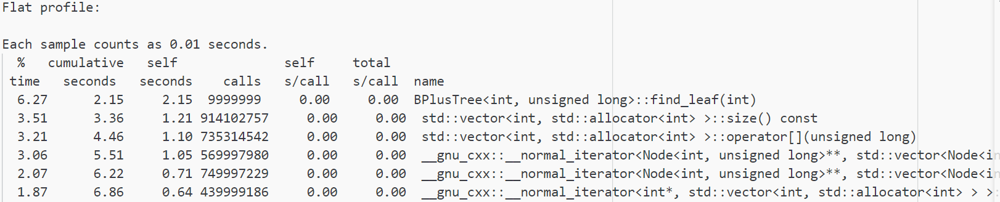
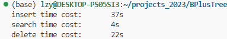

# B+Tree 任务报告

## 1 项目背景
### 1.1 B+Tree原理
- B+Tree是一颗多路平衡树，每个叶子结点到根节点距离都相同
- B+Tree 操作的时间通常由存取磁盘的时间和CPU计算时间这两部分构成，而CPU的速度非常快，所以B+Tree 的操作效率取决于访问磁盘的次数
- B+Tree 是多级索引；常用于密集索引，需要在叶子节点中存放键值key，该实现也是基于密集索引
- B+Tree 结点的要求：
  - 叶子结点存放键值对个数在$\lceil \frac{(n-1)}{2}\rceil$和$n-1$之间
  - 叶子结点之间通过双向链表相连接，便于遍历、插入和删除
  - 树上的每个非叶子结点的孩子个数在$\lceil \frac{n}{2}\rceil$和$n-1$之间
  - 根结点的孩子个数在$2$和$n-1$之间；但必须有两个及以上孩子结点，除非整个B+树只有一个结点

### 1.2 B+Tree意义
- 多路搜索树，每个结点存储的关键字更多
- 对数据库进行范围查找时，只需要搜索一个叶子结点，接着遍历满足条件的叶子结点，减少磁盘IO数
- B+Tree 能够保持数据稳定有序，其插入与删除拥有较稳定的对数时间复杂度
- 磁盘读写能力强，根结点和非叶子结点不存储数据区，一个结点保存更多的关键字
- 对表进行全表扫描，只需要遍历叶子节点就可以了，不需要遍历整棵 B+Tree 拿到所有的数据
- B+Tree 在叶子结点拿到数据，所以磁盘IO次数稳定

### 1.3 应用场景
- B+Tree 是为了磁盘或其它存储设备而设计的一种平衡多路查找树
- B+Tree 通过对每个结点存储键值个数的扩展，对连续的数据可以进行较快的定位和访问，提高存储的空间局部性从而减少IO操作，还可以进行快速的范围查找；因此适合磁盘操作较多的文件系统和数据库系统
## 2 详细设计
### 2.1 总体设计

### 2.2 关键流程
#### 2.2.1 查询&&范围查询
- 查询

- 范围查询

#### 2.2.2 插入
- 叶子结点
  - 直接插入：如果插入后，结点数量没有超过$n-1$，寻找到第一个不大于自己的位置，将键值对插入到叶子节点
  - 分裂结点：如果插入后，结点数量超过$n-1$，将前一半关键字和值拷贝到新结点中，原来的结点删除这些关键字和值
- 内部结点
  - 直接插入：增加关键字后，增加孩子指针
  - 分裂结点：将内部结点前一半的关键字和孩子指针拷贝到新结点中，原来的结点删除这些关键字和孩子指针
- 向父结点插入新结点；递归到原来的根节点，创建新结点其子结点是分裂的结点和原来的根结点

#### 2.2.3 删除
- 找到该关键字对应的叶子结点；删除该叶子结点上对应的叶子结点
- 如果此时叶子结点的关键字数量小于最小的容纳值；向兄弟结点借关键字或者和兄弟结点合并
- 继续处理父结点，删除该父结点上对应的关键字；如果父结点关键字数量小于最小的容纳值；向兄弟结点借关键字或者和兄弟结点合并
- 递归过程直到根结点删除结束；如果删除后根结点没有关键字，根结点变成原来根结点最左边的孩子结点
## 3 代码实现
### 3.1 目录组织
- .vscode: 环境配置
- bin: 生成可执行文件的文件夹
- doc: 项目相关文档
- include: 存放项目头文件
- lib: 存放第三方库
- src: 存放项目源文件
- test: 存放项目测试文件
- setup.sh: 项目启动脚本

### 3.2 安装&测试
- 在项目当前目录下执行如下命令
~~~shell
chmod +x setup.sh
./setup.sh
~~~

### 3.3 接口

### 3.4 关键代码
#### 3.4.1 insert_in_parent()
- 向父结点插入分裂后的结点；递归过程
~~~c++
template <typename K, typename T>
void BPlusTree<K, T>::insert_in_parent(
    std::tuple<Node<K, T>*, Node<K, T>*, K> result) {
  int key = std::get<2>(result);
  Node<K, T>* left = std::get<0>(result);
  Node<K, T>* right = std::get<1>(result);
  // old_node是根节点
  if (right->parent == nullptr) {
    Node<K, T>* new_root = new InternalNode<K, T>();
    this->depth_ += 1;
    new_root->keys.push_back(key);
    static_cast<InternalNode<K, T>*>(new_root)->child = {left, right};
    // static_cast<InternalNode<K, T>*>(new_root)->child.push_back(new_node);
    this->root_ = new_root;
    left->parent = this->root_;
    right->parent = this->root_;
    return;
  }

  Node<K, T>* parent = right->parent;
  bool op_inner = static_cast<InternalNode<K, T>*>(parent)->insert_inner(
      {left, right}, key);
  if (!op_inner) {
    std::cout << "failed to insert inner"
              << "\n";
  }
  if (parent->keys.size() > this->maxcap_) {
    std::tuple<Node<K, T>*, Node<K, T>*, K> new_inner =
        static_cast<InternalNode<K, T>*>(parent)->split_inner();
    insert_in_parent(new_inner);
  }
}
~~~
#### 3.4.2 内部结点的合并
- 将需要合并结点的父结点的值先插入该结点
~~~c++
template <typename K, typename T>
void BPlusTree<K, T>::merge_right_inner(int pos, Node<K, T>* node,
                                        Node<K, T>* next) {
  node->keys.insert(node->keys.end(), node->parent->keys[pos]);
  node->parent->keys.erase(node->parent->keys.begin() + pos);
  static_cast<InternalNode<K, T>*>(node->parent)
      ->child.erase(
          static_cast<InternalNode<K, T>*>(node->parent)->child.begin() + pos +
          1);

  // 插入合并的值
  node->keys.insert(node->keys.end(), next->keys.begin(), next->keys.end());
  static_cast<InternalNode<K, T>*>(node)->child.insert(
      static_cast<InternalNode<K, T>*>(node)->child.end(),
      static_cast<InternalNode<K, T>*>(next)->child.begin(),
      static_cast<InternalNode<K, T>*>(next)->child.end());
  for (Node<K, T>* child : static_cast<InternalNode<K, T>*>(node)->child) {
    child->parent = node;
  }
}
~~~
### 3.5 程序分析
#### 3.5.1 测试插入不同数量级的结点
- 插入测试1：插入结点数100-1000，每次增长100；从1000到10000，每次增长1000；
- 插入测试2：插入结点从10000到10万，每次增长10000；从10万到1百万，每次增加10万；
- 插入测试3：插入结点从1百万到7百万，每次增长50万

测试结果如下图所示

#### 3.5.2 插入1千万个结点
- 实现函数中执行时间较长的函数：find_leaf(), insert_inner(), split_leaf(), split_inner(), insert_leaf()
- 标准库函数[]运行时间较长

#### 3.5.3 valgrind测试
没有内存泄漏

## 4 测试
### 4.1 单元测试
#### 4.1.1 插入测试
##### 4.1.1.1 向空树插入结点
- 输入：<1,1>, <2,2>
~~~
[1,2]
~~~
##### 4.1.1.2 叶子结点分裂
- 输入：<1,1>, <2,2>, <3,3>
~~~
[2] 
[1] [2,3] 
~~~

##### 4.1.1.3 内部结点分裂
- 输入：<1,1>, <2,2>, <3,3>, <4,4>, <5,5>
~~~
[3] 
[2] [4] 
[1] [2] [3] [4,5]
~~~
#### 4.1.2 删除测试
##### 4.1.2.1 构建删除的树
~~~
[50] 
[30,40] [75,80] 
[0,20] [30] [40,45] [50] [75] [80,100] 
~~~
##### 4.1.2.2 删除叶子结点
- 删除：20
~~~
[50] 
[30,40] [75,80] 
[0] [30] [40,45] [50] [75] [80,100] 
~~~
##### 4.1.2.3 删除内部结点
- 删除：20, 80
~~~
[50] 
[30,40] [75,100] 
[0] [30] [40,45] [50] [75] [100] 
~~~
##### 4.1.2.4 从右叶子结点借元素
- 删除：20, 80, 30
~~~
[50] 
[40,45] [75,100] 
[0] [40] [45] [50] [75] [100] 
~~~

##### 4.1.2.5 从左叶子结点借元素
- 删除：20, 80, 40
~~~
[50] 
[30,45] [75,100] 
[0] [30] [45] [50] [75] [100] 
~~~
##### 4.1.2.6 与右叶子结点合并
- 删除：20, 80, 40, 0
~~~
[50] 
[45] [75,100] 
[30] [45] [50] [75] [100] 
~~~
##### 4.1.2.7 与左叶子结点合并
- 删除：20, 80, 40, 0, 100
~~~
[50] 
[45] [75] 
[30] [45] [50] [75] 
~~~
##### 4.1.2.8 与右内部结点合并
- 删除：20, 80, 40, 0, 100
- 插入：60
- 删除：50
~~~
[60] 
[45] [75] 
[30] [45] [60] [75] 
~~~
- 删除：30
~~~
[60,75] 
[45] [60] [75]
~~~
##### 4.1.2.9 与左内部结点合并
- 删除：20, 80, 40, 0, 100
- 插入：60
- 删除：50, 30
- 插入：80, 90
- 删除：80, 90
~~~

~~~
##### 4.1.2.10 从右内部结点借元素
- 删除：20, 80, 40, 0, 100
- 插入：60
- 删除：50, 30
- 插入：80, 90
- 删除：80, 90
- 插入：100
~~~
[75] 
[60] [80,90] 
[45] [60] [75] [80] [90,100] 
~~~
- 删除：45
~~~
[80] 
[75] [90] 
[60] [75] [80] [90,100] 
~~~
##### 4.1.2.11 从左内部结点借元素
- 删除：20, 80, 40, 0, 100
- 插入：60
- 删除：50, 30
- 插入：80, 90
- 删除：80, 90
- 插入：100
- 删除：45
- 插入：40, 50
- 删除：100
~~~
[80] 
[50,75] [90] 
[40] [50,60] [75] [80] [90]
~~~
- 删除：90
~~~
[75] 
[50] [80] 
[40] [50,60] [75] [80]
~~~

##### 4.1.2.12 删除直至空树
~~~ 
[50] 
[30,40] [75,80] 
[0,20] [30] [40,45] [50] [75] [80,100] 
...
[45] 
[20] [45] 

[20] 

[]
~~~
#### 4.1.3 查询测试
##### 4.1.3.1 单个key查询
- 首先向树中插入100个结点
- 对插入100个结点的key值进行查询
##### 4.1.3.2 范围查找
- 查询：1-20之间的数据
#### 4.1.4 测试结果

### 4.2 性能测试
- 插入1千万个结点：37s左右
- 查询1千万个结点：4s左右
- 删除1千万个结点：22s左右

## 5 总结

