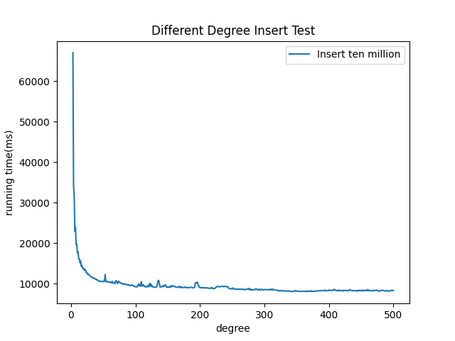
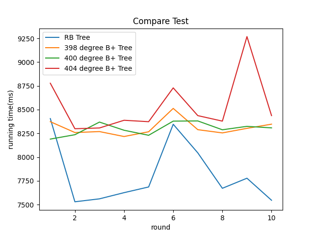

# B+Tree 任务报告

## 1 项目背景
### 1.1 B+Tree原理
- B+Tree是一颗多路平衡树，每个叶子结点到根节点距离都相同
- B+Tree 操作的时间通常由存取磁盘的时间和CPU计算时间这两部分构成，而CPU的速度非常快，所以B+Tree 的操作效率取决于访问磁盘的次数
- B+Tree 是多级索引；常用于密集索引，需要在叶子节点中存放键值key，该实现也是基于密集索引
- B+Tree 结点的要求：
  - 叶子结点存放键值对个数在$\lceil \frac{(n-1)}{2}\rceil$和$n-1$之间
  - 叶子结点之间通过双向链表相连接，便于遍历、插入和删除
  - 树上的每个非叶子结点的孩子个数在$\lceil \frac{n}{2}\rceil$和$n-1$之间
  - 根结点的孩子个数在$2$和$n-1$之间；但必须有两个及以上孩子结点，除非整个B+树只有一个结点

### 1.2 B+Tree意义
- 多路搜索树，每个结点存储的关键字更多
- 对数据库进行范围查找时，只需要搜索一个叶子结点，接着遍历满足条件的叶子结点，减少磁盘IO数
- B+Tree 能够保持数据稳定有序，其插入与删除拥有较稳定的对数时间复杂度
- 磁盘读写能力强，根结点和非叶子结点不存储数据区，一个结点保存更多的关键字
- 对表进行全表扫描，只需要遍历叶子节点就可以了，不需要遍历整棵 B+Tree 拿到所有的数据
- B+Tree 在叶子结点拿到数据，所以磁盘IO次数稳定

### 1.3 应用场景
- B+Tree 是为了磁盘或其它存储设备而设计的一种平衡多路查找树
- B+Tree 通过对每个结点存储键值个数的扩展，对连续的数据可以进行较快的定位和访问，提高存储的空间局部性从而减少IO操作，还可以进行快速的范围查找；因此适合磁盘操作较多的文件系统和数据库系统
## 2 详细设计
### 2.1 总体设计

### 2.2 关键流程
#### 2.2.1 查询&&范围查询
- 查询

- 范围查询

#### 2.2.2 插入
- 叶子结点
  - 直接插入：如果插入后，结点数量没有超过$n-1$，寻找到第一个不大于自己的位置，将键值对插入到叶子节点
  - 分裂结点：如果插入后，结点数量超过$n-1$，将前一半关键字和值拷贝到新结点中，原来的结点删除这些关键字和值
- 内部结点
  - 直接插入：增加关键字后，增加孩子指针
  - 分裂结点：将内部结点前一半的关键字和孩子指针拷贝到新结点中，原来的结点删除这些关键字和孩子指针
- 向父结点插入新结点；递归到原来的根节点，创建新结点其子结点是分裂的结点和原来的根结点

#### 2.2.3 删除
- 找到该关键字对应的叶子结点；删除该叶子结点上对应的叶子结点
- 如果此时叶子结点的关键字数量小于最小的容纳值；向兄弟结点借关键字或者和兄弟结点合并
- 继续处理父结点，删除该父结点上对应的关键字；如果父结点关键字数量小于最小的容纳值；向兄弟结点借关键字或者和兄弟结点合并
- 递归过程直到根结点删除结束；如果删除后根结点没有关键字，根结点变成原来根结点最左边的孩子结点

#### 2.2.4 序列化反序列化
##### 注意
- 读文件时，需要将叶子结点的关系进行重建；需要找到每个叶子结点的前驱结点
  - 策略：将叶子结点读取完毕后，需要重建叶子结点的链表；需要找到每个叶子结点的前驱结点；进行链表的复原
##### DFS版本
- 序列化
  - 先把B+树的除根结点以外的成员写入；
  - 写结点：
    - 写入is_leaf, 关键字数量, 所有的关键字；
    - 对内部结点的孩子递归该过程；
    - 对叶子结点直接读入关键字对应的值
- 反序列化，最后返回根结点：
  - 先把B+树的除根结点以外的成员读入；
  - 读结点，最后返回一个结点：
    - 读is_leaf, 关键字数量, 所有的关键字；
    - 递归该过程，返回的结点是该结点的孩子结点；
    - 对叶子结点直接读入关键字对应的值
##### BFS版本
- 序列化
  - 先把B+树的除根结点以外的成员写入；
  - 写结点：
    - 写入is_leaf, 关键字数量, 所有的关键字；
    - 层次遍历所有结点
    - 到达叶子结点直接读入关键字对应的值
- 反序列化，最后返回根结点：
  - 先把B+树的除根结点以外的成员读入；
  - 读结点，最后返回一个结点：
    - 读is_leaf, 关键字数量, 所有的关键字；
    - 读当前结点的孩子结点，将孩子结点加入队列，按层次遍历恢复整个树；

#### 2.2.5 并发B+树
##### 查找并发
- 使用读写锁的读锁进行并发控制
- 策略：
  - 获取当前结点孩子结点的锁，同时释放当前结点的锁；直至获得叶子结点；查找完毕后释放该叶子结点的锁

##### 插入并发
- 使用读写锁的写锁进行并发控制
- 策略：
  - 从根结点开始获取写锁，先获取孩子结点的写锁，如果该结点插入后不分裂，可以释放其所有祖先的写锁；
  - 否则一直持有锁直至B+树调整结束
  - 使用队列来存放祖先结点，通过队列来释放祖先结点的锁
  - 分裂的新结点不会被访问到，所有不需要加锁

##### 删除并发
- 使用读写锁的写锁进行并发控制
- 策略：
  - 从根结点开始获取写锁，先获取孩子结点的写锁，如果该结点删除后不合并和借出，可以释放其所有祖先的写锁；
  - 否则一直持有锁直至B+树调整结束
  - 使用队列来存放祖先结点，通过队列来释放祖先结点的锁
  - 在进行调整过程中，如果需要合并和借关键字，不需要将兄弟结点的锁加入队列，只需要在借和合并过程中获取和释放锁

## 3 代码实现
### 3.1 目录组织
- .vscode: 环境配置
- doc: 项目相关文档
- include: 存放项目头文件
- third_party: 存放第三方库
- src: 存放项目源文件
- test: 存放项目测试文件
- setup.sh: 项目启动脚本
- test.sh: 进行单元测试和1千万结点的性能测试

### 3.2 安装&测试
- 项目启动：在项目当前目录下执行如下命令
~~~shell
chmod +x setup.sh
./setup.sh
~~~
- 项目测试：进行单元测试和性能测试
~~~shell
chmod +x test.sh
./test.sh
~~~

### 3.3 接口

### 3.4 关键代码
#### 3.4.1 insert_in_parent()
- 向父结点插入分裂后的结点；递归过程
~~~c++
template <typename K, typename T>
void BPlusTree<K, T>::insert_in_parent(
    std::tuple<Node<K, T>*, Node<K, T>*, K> result) {
  int key = std::get<2>(result);
  Node<K, T>* left = std::get<0>(result);
  Node<K, T>* right = std::get<1>(result);
  // old_node是根节点
  if (right->parent == nullptr) {
    Node<K, T>* new_root = new InternalNode<K, T>();
    this->depth_ += 1;
    new_root->keys.push_back(key);
    static_cast<InternalNode<K, T>*>(new_root)->child = {left, right};
    // static_cast<InternalNode<K, T>*>(new_root)->child.push_back(new_node);
    this->root_ = new_root;
    left->parent = this->root_;
    right->parent = this->root_;
    return;
  }

  Node<K, T>* parent = right->parent;
  bool op_inner = static_cast<InternalNode<K, T>*>(parent)->insert_inner(
      {left, right}, key);
  if (!op_inner) {
    std::cout << "failed to insert inner"
              << "\n";
  }
  if (parent->keys.size() > this->maxcap_) {
    std::tuple<Node<K, T>*, Node<K, T>*, K> new_inner =
        static_cast<InternalNode<K, T>*>(parent)->split_inner();
    insert_in_parent(new_inner);
  }
}
~~~
#### 3.4.2 内部结点的合并
- 将需要合并结点的父结点的值先插入该结点
~~~c++
template <typename K, typename T>
void BPlusTree<K, T>::merge_right_inner(int pos, Node<K, T>* node,
                                        Node<K, T>* next) {
  node->keys.insert(node->keys.end(), node->parent->keys[pos]);
  node->parent->keys.erase(node->parent->keys.begin() + pos);
  static_cast<InternalNode<K, T>*>(node->parent)
      ->child.erase(
          static_cast<InternalNode<K, T>*>(node->parent)->child.begin() + pos +
          1);

  // 插入合并的值
  node->keys.insert(node->keys.end(), next->keys.begin(), next->keys.end());
  static_cast<InternalNode<K, T>*>(node)->child.insert(
      static_cast<InternalNode<K, T>*>(node)->child.end(),
      static_cast<InternalNode<K, T>*>(next)->child.begin(),
      static_cast<InternalNode<K, T>*>(next)->child.end());
  for (Node<K, T>* child : static_cast<InternalNode<K, T>*>(node)->child) {
    child->parent = node;
  }
}
~~~

#### 3.4.3 DFS进行反序列化
##### 3.4.3.1 寻找前驱结点
~~~c++
template <typename K, typename T>
Node<K, T>* search_pre_node(Node<K, T>* node) {
  if (node == nullptr || !node->is_leaf) {
    return nullptr;
  }
  int index = 0;
  Node<K, T>* parent = nullptr;
  Node<K, T>* prenode = nullptr;

  if (node->parent == nullptr) {
    return nullptr;
  }

  while (node->parent != nullptr) {
    parent = node->parent;
    index = 0;
    // 寻找孩子结点对应的index
    while (static_cast<InternalNode<K, T>*>(parent)->child[index] != node) {
      index++;
    }

    if (index) {
      // 寻找其兄弟结点最右侧的叶子结点
      prenode = static_cast<InternalNode<K, T>*>(parent)->child[index - 1];
      // 一直到叶子结点
      while (!prenode->is_leaf) {
        prenode = static_cast<InternalNode<K, T>*>(prenode)
                      ->child[prenode->keys.size()];
      }
      return prenode;
    }
    // 该结点为最左侧孩子结点
    node = parent;
  }
  return nullptr;
}
~~~

##### 3.4.3.2 反序列化重建链表
~~~c++
if (!is_leaf) {
    for (int i = 0; i < num + 1; ++i) {
      static_cast<InternalNode<K, T>*>(pnode)->child.push_back(
          read_node<K, T>(fd, pnode));
    }
    // 叶子结点链表恢复
    for (int i = 0; i < num + 1; ++i) {
      Node<K, T>* node = static_cast<InternalNode<K, T>*>(pnode)->child[i];
      // 将链表连接起来
      // 找到每个结点的前驱结点
      Node<K, T>* prenode = search_pre_node(node);
      if (prenode) {
        static_cast<LeafNode<K, T>*>(prenode)->next =
            static_cast<LeafNode<K, T>*>(node);
        static_cast<LeafNode<K, T>*>(node)->prev =
            static_cast<LeafNode<K, T>*>(prenode);
      }
    }
  } else {
    // 读叶子结点
    int data = 0;
    for (int i = 0; i < num; ++i) {
      if (read(fd, &data, sizeof(T)) == -1) {
        throw std::runtime_error("read data element error\n");
      }
      static_cast<LeafNode<K, T>*>(pnode)->data.push_back(data);
    }
  }
~~~
#### 3.4.4 BFS进行反序列化
~~~c++
template <typename K, typename T>
void Serialization::write_node_bfs(const int& fd, Node<K, T>* node) {
  std::queue<Node<K, T>*> q;
  q.push(node);
  while (!q.empty()) {
    Node<K, T>* now = q.front();
    q.pop();

    if (write(fd, &now->is_leaf, sizeof(bool)) == -1) {
      throw std::runtime_error("write node is_leaf error\n");
    }
    int num = now->keys.size();
    // 写关键字数量
    if (write(fd, &num, sizeof(int)) == -1) {
      throw std::runtime_error("write node keys size error\n");
    }
    // 写关键字
    for (int i = 0; i < num; ++i) {
      if (write(fd, &now->keys[i], sizeof(K)) == -1) {
        throw std::runtime_error("write node keys element error\n");
      }
    }

    if (!now->is_leaf) {
      for (int i = 0; i < num + 1; ++i) {
        q.push(static_cast<InternalNode<K, T>*>(now)->child[i]);
      }
    } else {
      // 写值
      for (int i = 0; i < num; ++i) {
        if (write(fd, &static_cast<LeafNode<K, T>*>(now)->data[i], sizeof(T)) ==
            -1) {
          throw std::runtime_error("write data element error\n");
        }
      }
    }
  }
}
~~~
### 3.5 程序分析
#### 3.5.1 测试插入不同度的B+树
- 从4度到500度，每次增加2
- 结果显示度为18到20之间，插入的时间最短

测试结果如下图所示
- 将寻找叶子结点线性查找

- 寻找叶子结点二分查找

#### 3.5.2 插入1千万个结点
- 实现函数中执行时间较长的函数：find_leaf() (因为线性查找), find_first_big_pos(), split_leaf(), insert_leaf()
- 标准库函数operator[], size(), end()运行时间较长

~~~shell
Each sample counts as 0.01 seconds.
  %   cumulative   self              self     total           
 time   seconds   seconds    calls   s/call   s/call  name    
 32.87      2.24     2.24 1449871046     0.00     0.00  std::vector<int, std::allocator<int> >::operator
 23.61      3.84     1.61  9999999     0.00     0.00  BPlusTree<int, unsigned long>::find_leaf(int)
  2.87      4.04     0.20 11099985     0.00     0.00  Node<int, unsigned long>::find_first_big_pos(int)
  2.35      4.20     0.16 12999992     0.00     0.00  std::vector<unsigned long, std::allocator<unsigned long> >::end()
  1.62      4.31     0.11 70899824     0.00     0.00  __gnu_cxx::__normal_iterator<int*, std::vector<int, std::allocator<int> > >::__normal_iterator(int* const&)
  1.54      4.41     0.11 138568042     0.00     0.00  std::vector<int, std::allocator<int> >::size() const
  1.47      4.51     0.10 16699971     0.00     0.00  __gnu_cxx::__normal_iterator<int*, std::vector<int, std::allocator<int> > >::operator+(long) const
  1.32      4.60     0.09 11099985     0.00     0.00  std::vector<int, std::allocator<int> >::insert(__gnu_cxx::__normal_iterator<int const*, std::vector<int, std::allocator<int> > >, int const&)
  1.03      4.67     0.07 10000000     0.00     0.00  LeafNode<int, unsigned long>::insert_leaf(int, unsigned long)
  1.03      4.74     0.07  9999999     0.00     0.00  std::vector<unsigned long, std::allocator<unsigned long> >::insert(__gnu_cxx::__normal_iterator<unsigned long const*, std::vector<unsigned long, std::allocator<unsigned long> > >, unsigned long const&)
  0.96      4.81     0.07 66599971     0.00     0.00  __gnu_cxx::__normal_iterator<int const*, std::vector<int, std::allocator<int> > >::base() const
  0.88      4.87     0.06 56634030     0.00     0.00  std::vector<Node<int, unsigned long>*, std::allocator<Node<int, unsigned long>*> >::operator
  0.74      4.92     0.05 62999994     0.00     0.00  __gnu_cxx::__normal_iterator<unsigned long*, std::vector<unsigned long, std::allocator<unsigned long> > >::__normal_iterator(unsigned long* const&)
  0.74      4.97     0.05  5100008     0.00     0.00  unsigned long const& std::min<unsigned long>(unsigned long const&, unsigned long const&)
  0.59      5.01     0.04 53799820     0.00     0.00  __gnu_cxx::__normal_iterator<int*, std::vector<int, std::allocator<int> > >::base() const
  0.59      5.05     0.04 46999999     0.00     0.00  __gnu_cxx::__normal_iterator<unsigned long*, std::vector<unsigned long, std::allocator<unsigned long> > >::base() const
  0.59      5.09     0.04 28199968     0.00     0.00  std::vector<int, std::allocator<int> >::begin()
  0.59      5.13     0.04 25000004     0.00     0.00  std::vector<unsigned long, std::allocator<unsigned long> >::begin()
  0.59      5.17     0.04 14999999     0.00     0.00  __gnu_cxx::__normal_iterator<unsigned long*, std::vector<unsigned long, std::allocator<unsigned long> > >::operator+(long) const
  0.59      5.21     0.04 13299969     0.00     0.00  _ZN9__gnu_cxx17__normal_iteratorIPKiSt6vectorIiSaIiEEEC2IPiEERKNS0_IT_NS_11__enable_ifIXsr3std10__are_sameIS9_S8_EE7__valueES5_E6__typeEEE
  0.59      5.25     0.04 12099922     0.00     0.00  void __gnu_cxx::new_allocator<int>::construct<int, int const&>(int*, int const&)
  0.59      5.29     0.04 10000000     0.00     0.00  BPlusTree<int, unsigned long>::tree_insert(int, unsigned long)
  0.59      5.33     0.04   999999     0.00     0.00  LeafNode<int, unsigned long>::split_leaf()
~~~
- 改为二分查找后；二分查找函数执行时间最长
~~~shell
Each sample counts as 0.01 seconds.
  %   cumulative   self              self     total           
 time   seconds   seconds    calls   s/call   s/call  name    
 26.58      1.40     1.40 59488177     0.00     0.00  Node<int, unsigned long>::find_first_big_pos(int)
 15.24      2.20     0.80 525546745     0.00     0.00  std::vector<int, std::allocator<int> >::operator
  5.24      2.47     0.28 19999998     0.00     0.00  BPlusTree<int, unsigned long>::find_leaf(int)
  4.00      2.68     0.21 19999998     0.00     0.00  std::vector<unsigned long, std::allocator<unsigned long> >::insert(__gnu_cxx::__normal_iterator<unsigned long const*, std::vector<unsigned long, std::allocator<unsigned long> > >, unsigned long const&)
  3.24      2.85     0.17 101270671     0.00     0.00  __gnu_cxx::__normal_iterator<int*, std::vector<int, std::allocator<int> > >::__normal_iterator(int* const&)
  2.95      3.01     0.16 20000000     0.00     0.00  LeafNode<int, unsigned long>::insert_leaf(int, unsigned long)
  2.86      3.16     0.15 119057281     0.00     0.00  std::vector<int, std::allocator<int> >::size() const
  2.76      3.30     0.15 80070335     0.00     0.00  __gnu_cxx::__normal_iterator<int const*, std::vector<int, std::allocator<int> > >::__normal_iterator(int const* const&)
  2.10      3.41     0.11 20422029     0.00     0.00  __gnu_cxx::__normal_iterator<int*, std::vector<int, std::allocator<int> > >::operator+(long) const
  2.10      3.52     0.11 20070277     0.00     0.00  std::vector<int, std::allocator<int> >::insert(__gnu_cxx::__normal_iterator<int const*, std::vector<int, std::allocator<int> > >, int const&)
  2.10      3.63     0.11 40280027     0.00     0.00  int const& std::forward<int const&>(std::remove_reference<int const&>::type&)
  1.71      3.72     0.09 120421738     0.00     0.00  __gnu_cxx::__normal_iterator<int const*, std::vector<int, std::allocator<int> > >::base() const
  1.71      3.81     0.09 100910006     0.00     0.00  __gnu_cxx::__normal_iterator<unsigned long*, std::vector<unsigned long, std::allocator<unsigned long> > >::__normal_iterator(unsigned long* const&)
  1.71      3.90     0.09 20209975     0.00     0.00  std::vector<unsigned long, std::allocator<unsigned long> >::end()
  1.62      3.99     0.09 40000000     0.00     0.00  bool __gnu_cxx::operator==<int const*, std::vector<int, std::allocator<int> > >(__gnu_cxx::__normal_iterator<int const*, std::vector<int, std::allocator<int> > > const&, __gnu_cxx::__normal_iterator<int const*, std::vector<int, std::allocator<int> > > const&)
  1.52      4.07     0.08 20138683     0.00     0.00  void std::allocator_traits<std::allocator<int> >::construct<int, int const&>(std::allocator<int>&, int*, int const&)
  1.52      4.15     0.08 20000000     0.00     0.00  BPlusTree<int, unsigned long>::tree_insert(int, unsigned long)
  1.43      4.22     0.08 40000000     0.00     0.00  std::vector<int, std::allocator<int> >::end() const
  1.33      4.29     0.07 40494682     0.00     0.00  std::vector<int, std::allocator<int> >::begin()
  1.14      4.35     0.06 40350026     0.00     0.00  std::vector<unsigned long, std::allocator<unsigned long> >::begin()
~~~
#### 3.5.3 valgrind测试
没有内存泄漏

## 4 测试
### 4.1 单元测试
#### 4.1.1 插入测试
##### 4.1.1.1 向空树插入结点
- 输入：<1,1>, <2,2>
~~~
[1,2]
~~~
##### 4.1.1.2 叶子结点分裂
- 输入：<1,1>, <2,2>, <3,3>
~~~
[2] 
[1] [2,3] 
~~~

##### 4.1.1.3 内部结点分裂
- 输入：<1,1>, <2,2>, <3,3>, <4,4>, <5,5>
~~~
[3] 
[2] [4] 
[1] [2] [3] [4,5]
~~~
#### 4.1.2 删除测试
##### 4.1.2.1 构建删除的树
~~~
[50] 
[30,40] [75,80] 
[0,20] [30] [40,45] [50] [75] [80,100] 
~~~
##### 4.1.2.2 删除叶子结点
- 删除：20
~~~
[50] 
[30,40] [75,80] 
[0] [30] [40,45] [50] [75] [80,100] 
~~~
##### 4.1.2.3 删除内部结点
- 删除：20, 80
~~~
[50] 
[30,40] [75,100] 
[0] [30] [40,45] [50] [75] [100] 
~~~
##### 4.1.2.4 从右叶子结点借元素
- 删除：20, 80, 30
~~~
[50] 
[40,45] [75,100] 
[0] [40] [45] [50] [75] [100] 
~~~

##### 4.1.2.5 从左叶子结点借元素
- 删除：20, 80, 40
~~~
[50] 
[30,45] [75,100] 
[0] [30] [45] [50] [75] [100] 
~~~
##### 4.1.2.6 与右叶子结点合并
- 删除：20, 80, 40, 0
~~~
[50] 
[45] [75,100] 
[30] [45] [50] [75] [100] 
~~~
##### 4.1.2.7 与左叶子结点合并
- 删除：20, 80, 40, 0, 100
~~~
[50] 
[45] [75] 
[30] [45] [50] [75] 
~~~
##### 4.1.2.8 与右内部结点合并
- 删除：20, 80, 40, 0, 100
- 插入：60
- 删除：50
~~~
[60] 
[45] [75] 
[30] [45] [60] [75] 
~~~
- 删除：30
~~~
[60,75] 
[45] [60] [75]
~~~
##### 4.1.2.9 与左内部结点合并
- 删除：20, 80, 40, 0, 100
- 插入：60
- 删除：50, 30
- 插入：80, 90
- 删除：80, 90
~~~

~~~
##### 4.1.2.10 从右内部结点借元素
- 删除：20, 80, 40, 0, 100
- 插入：60
- 删除：50, 30
- 插入：80, 90
- 删除：80, 90
- 插入：100
~~~
[75] 
[60] [80,90] 
[45] [60] [75] [80] [90,100] 
~~~
- 删除：45
~~~
[80] 
[75] [90] 
[60] [75] [80] [90,100] 
~~~
##### 4.1.2.11 从左内部结点借元素
- 删除：20, 80, 40, 0, 100
- 插入：60
- 删除：50, 30
- 插入：80, 90
- 删除：80, 90
- 插入：100
- 删除：45
- 插入：40, 50
- 删除：100
~~~
[80] 
[50,75] [90] 
[40] [50,60] [75] [80] [90]
~~~
- 删除：90
~~~
[75] 
[50] [80] 
[40] [50,60] [75] [80]
~~~

##### 4.1.2.12 删除直至空树
~~~ 
[50] 
[30,40] [75,80] 
[0,20] [30] [40,45] [50] [75] [80,100] 
...
[45] 
[20] [45] 

[20] 

[]
~~~
#### 4.1.3 查询测试
##### 4.1.3.1 单个key查询
- 首先向树中插入100个结点
- 对插入100个结点的key值进行查询
##### 4.1.3.2 范围查找
- 查询：1-20之间的数据

#### 测试结果

#### 4.1.5 序列化反序化测试
- 输入：tree(插入<1,1>,<2,2>,<3,3>)
- 反序列化后，插入：<4,4>; 然后依次删除直到成为空树
~~~shell
tree before serialize:
[2] 
[1] [2,3] 
serialized content length:      67
tree after deserialize:
[2] 
[1] [2,3] 
insert <4,4>
[2,3] 
[1] [2] [3,4] 
delete 1
[3] 
[2] [3,4] 
delete 2
[4] 
[3] [4] 
delete 3
[4] 
delete 4
[]
~~~
### 4.2 性能测试
#### 4.2.1 与RB Tree比较
- 分别对度为16, 18, 20的B+树和红黑树插入1千万个结点

#### 4.2.2 对18度和20度，400和404度B+树测试
~~~shell
18 B+ tree insert time cost:    5801ms
search time cost:       3013ms
delete time cost:       10ms
20 B+ tree insert time cost:    5622ms
search time cost:       3020ms
delete time cost:       11ms

400 B+ tree insert time cost:   3557ms
search time cost:       2816ms
delete time cost:       8ms
404 B+ tree insert time cost:   3552ms
search time cost:       2816ms
delete time cost:       9ms
~~~
## 5 总结
- 插入操作
  - 最开始寻找插入位置, 寻找key在关键字数组中的索引都使用的for循环线性查找; 现在改为二分查找
  - key数量超过最大容纳数量后,需要分裂结点,最初只返回一个新分裂的结点
  - 实际插入过程中发现还需要分裂后新结点的首个key; `insert_in_parent`函数需要同时传入原来的结点和分裂后的结点;
  - 最后`split_leaf`,`split_inner`的返回值设计为`std::tuple<Node<K,T>*, Node<K,T>*, int>`形式; `insert_in_parent`函数参数也为该形式
- 删除操作
  - 将结点的借出操作和合并操作定义在B+树中, 方便操作
  - 合并内部结点, 最开始直接将兄弟结点的关键字直接插入, 发现树的变化有问题; 发现需要考虑该结点的父结点的关键字
- 序列化反序列化

   > DFS反序列化最开始忘记叶子结点链表的构建, 反序列化后的B+树删除有问题
  - DFS反序列化叶子结点链表的构建
    - 需要找到叶子结点的前驱结点
    - 在内部结点处理逻辑中进行叶子结点链表的恢复
  - 增加BFS序列化和反序列结点函数
  - 使用open函数, clang-tidy 提示`Do not call c-style vararg functions`, 在clang-tidy中排除检查即可

